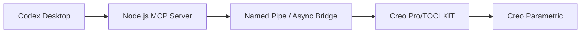

# Codex × Creo MCP

这是一个面向 Windows 和 Creo Parametric 的 Codex MCP 集成项目。它通过 Node.js MCP 服务、Pro/TOOLKIT 原生桥接程序和可选的 Creo 常驻 DLL，让 Codex 能够读取与修改当前 Creo 会话。

当前版本提供 60 项正式 MCP 工具，覆盖模型读取、参数与尺寸、常用零件特征、装配、骨架、钣金、STEP 导出和版本清理。

## 核心规则

- 每次命令先从当前 Creo 会话读取用户已经选择的工作目录。
- 所有文件操作只允许作用于该工作目录的直接子文件。
- 工具不接受 `project_name`、固定项目根目录或调用方提供的目录路径。
- 不上传或附带 Creo、Pro/TOOLKIT、WJT276、公司模型、配置文件或其他第三方二进制。
- 写入工具在修改前核对模型、特征、尺寸和旧值，失败时尽量回滚。

## 架构

详细说明见 [架构文档](docs/ARCHITECTURE.md)。

## 安装概要

1. 安装 Creo Parametric、匹配版本的 Pro/TOOLKIT 和 Visual Studio Build Tools C++。
2. 安装 Node.js 20 或更高版本。
3. 设置 `CREO_COMMON_FILES` 和 `VSDEVCMD`，运行 `build_all.cmd`。
4. 运行 `install.ps1`，将 MCP 服务和编译产物安装到用户目录。
5. 根据模板配置 Codex MCP 和 Creo Toolkit 注册文件。
6. 重启 Codex 与 Creo 后进行只读握手测试。

完整步骤见 [Windows 安装教程](docs/INSTALL_WINDOWS.md)。

## 目录

- `mcp/`：MCP 服务和安全清理脚本。
- `native/`：Pro/TOOLKIT C 源码。
- `scripts/`：常驻桥接快捷命令脚本。
- `config/`：脱敏配置模板。
- `docs/`：架构、安装、工具和故障排除文档。
- `tests/`：目录策略和静态安全检查。

## 重要警告

Creo 的同步 Pro/TOOLKIT 调用可能清空原生撤销栈。启用持续轮询的常驻 DLL 前，请阅读 [撤销与常驻桥接](docs/UNDO_AND_RESIDENT.md)。

## 第三方软件

PTC Creo、Pro/TOOLKIT、Visual Studio Build Tools、Codex 和 WJT276 均不包含在本仓库中。请自行取得合法安装包、许可和 SDK。
